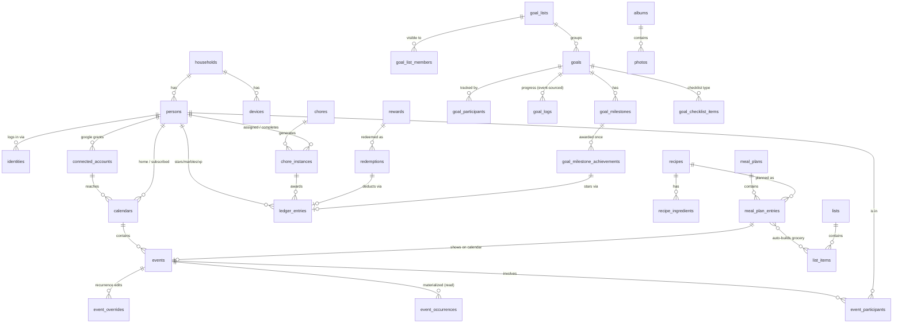

# Nook — Data Model

The system-of-record schema (Postgres). This is the design source of truth; tables are
implemented incrementally per the roadmap (migrations), but the whole picture lives here so
relationships and conventions stay coherent.

> Status: first complete pass (chunk 1.0). Expect refinement during implementation — the
> shapes and decisions are settled, exact columns may shift.

---

## How to read this

### Base columns (every tenant-scoped table)

Unless noted, every table includes this spine:

```sql
id           uuid        primary key default gen_random_uuid(),  -- app supplies it (offline-mintable)
household_id uuid        not null references households(id),
created_at   timestamptz not null default now(),
updated_at   timestamptz not null default now(),   -- maintained by trigger below
deleted_at   timestamptz                            -- soft-delete tombstone
```

In the DDL below, `<base>` stands in for these five columns to keep tables readable.
`households` itself has no `household_id`. Append-only tables (`*_logs`, `ledger_entries`)
keep `deleted_at` for sync but are never updated — corrections are new rows.

### Conventions

- **UUID PKs are client-generated.** The default is a fallback; clients (incl. offline iOS)
  mint the id so rows created offline have stable identity. Required by PowerSync.
- **Soft-delete everywhere.** Queries filter `WHERE deleted_at IS NULL` (partial indexes do
  too). A maintenance job hard-purges old tombstones after clients have synced.
- **`household_id` on everything**, indexed — the multi-tenant boundary.
- **Enums as `text` + documented values** (migration-friendly vs PG enums); tighten with
  `CHECK` constraints as values stabilize.
- **RLS is off in v1.** The `api` enforces `household_id` scoping and PowerSync sync rules
  enforce read isolation. RLS is the later defense-in-depth layer.
- **`updated_at` trigger** applied to all mutable tables:

```sql
create or replace function set_updated_at() returns trigger as $$
begin new.updated_at = now(); return new; end; $$ language plpgsql;
-- create trigger trg_<table>_updated before update on <table>
--   for each row execute function set_updated_at();
```

### Entity overview



---

## 1. Identity & household

```sql
create table households (
  id              uuid primary key default gen_random_uuid(),
  name            text not null,
  timezone        text not null,                 -- IANA, e.g. 'America/Chicago'
  week_start      text not null default 'sunday',-- sunday | monday
  owner_person_id uuid,                           -- the single owner; implies admin (FK added after persons)
  settings        jsonb not null default '{}',    -- display/screensaver/misc prefs
  created_at      timestamptz not null default now(),
  updated_at      timestamptz not null default now(),
  deleted_at      timestamptz
);

create table persons (
  <base>,
  name         text not null,
  member_type  text not null,                     -- adult | teen | kid  (family category)
  is_admin     boolean not null default false,    -- full management rights (Kevin + Kelly)
  avatar_type  text not null default 'emoji',      -- emoji | image
  avatar_emoji text,                               -- 🐻 🦊 🐢 🦄
  avatar_url   text,                               -- S3 media object when avatar_type='image'
  color_hex    text,
  palette_slot text,                               -- optional design-token key
  birthday     date,                               -- drives "age 7"
  dietary_notes text,                              -- "no spicy", "no mushrooms"
  reward_style text not null default 'stars',       -- stars | stickers | jar | levels (UI only)
  show_on_kiosk boolean not null default true,
  sort_order   int not null default 0
);

create table identities (                          -- only members who log in (kids have none)
  <base>,
  person_id      uuid not null references persons(id),
  provider       text not null,                    -- google | apple | password
  auth0_user_id  text not null unique,             -- the JWT 'sub'
  email          text,
  email_verified boolean not null default false,   -- auto-link only on verified match
  is_primary     boolean not null default false
);

create table connected_accounts (                  -- Google OAuth grants for Calendar (encrypted)
  <base>,
  person_id        uuid not null references persons(id),
  provider         text not null default 'google',
  account_email    text not null,
  access_token_enc  bytea not null,                -- AES-GCM w/ TOKEN_ENCRYPTION_KEY
  refresh_token_enc bytea not null,
  token_expires_at timestamptz,
  scopes           text[] not null,
  status           text not null default 'active'  -- active | needs_reauth
);

create table calendars (                           -- person ↔ Google calendar mapping
  <base>,
  connected_account_id uuid references connected_accounts(id),  -- which token reaches it
  person_id        uuid references persons(id),    -- whose calendar (null = shared "Family")
  google_calendar_id text not null,
  name             text, color_hex text,
  access_role      text not null,                   -- owner | writer | reader
  is_home_calendar boolean not null default false,  -- write-back target for this person
  is_subscribed    boolean not null default true,   -- read source
  sync_token       text,                            -- Google incremental token (per-calendar)
  watch_channel_id text, watch_expires_at timestamptz  -- push channels (later)
);

create table devices (
  <base>,
  name             text,                            -- "Kitchen kiosk"
  type             text not null,                   -- kiosk | ios | web
  device_token_hash text,                           -- long-lived device session (kiosk)
  apns_push_token  text,                            -- iOS push target
  paired_at        timestamptz, last_seen_at timestamptz
);

alter table households add constraint fk_owner
  foreign key (owner_person_id) references persons(id);
```

**Auth wiring:** first login → create `households` + `persons(member_type='adult', is_admin)`
+ `identities` → write `household_id`/`person_id`/`is_admin` into Auth0 app_metadata; the Auth0
action copies them into the JWT so the `api` authorizes straight from the token. `identities`
mirrors that mapping (one person ↔ many identities; auto-link only on a *verified* matching email).

---

## 2. Calendar

Two-layer: `events` + `event_overrides` are the **edit/sync source of truth** (and the Google
write-back target); `event_occurrences` is the **materialized read model** clients render.

```sql
create table events (                              -- masters + single events
  <base>,
  calendar_id  uuid references calendars(id),       -- source/home calendar
  -- ── GOOGLE-OWNED (inbound sync overwrites; Google wins for google-origin) ──
  title text not null, description text, location text,
  starts_at timestamptz not null, ends_at timestamptz,
  all_day boolean not null default false,
  timezone text not null,                            -- IANA; DST-correct recurrence
  rrule text, rdate timestamptz[], exdate timestamptz[],  -- RFC5545; rrule null = non-recurring
  recurrence_end_at timestamptz,                     -- last possible occurrence; null = infinite
  status text not null default 'confirmed',          -- confirmed | tentative | cancelled
  reminders jsonb,                                   -- [{method,minutes}] → Google reminders.overrides
  -- ── NOOK-OWNED (sync NEVER overwrites) ──
  person_id uuid references persons(id),             -- assignee → color
  origin text not null default 'manual',             -- manual | google | meal_plan | task | ai_capture
  origin_ref_id uuid,                                -- soft link to source row (meal_plan_entry, …)
  -- ── Google sync bookkeeping ──
  google_event_id text, ical_uid text, etag text, sequence int, google_updated timestamptz,
  sync_state text not null default 'local_only'      -- local_only | pending_push | synced | push_failed
);
create unique index uq_events_google on events (calendar_id, google_event_id)
  where google_event_id is not null;
create index ix_events_household_start on events (household_id, starts_at) where deleted_at is null;
create index ix_events_recurrence on events (household_id, recurrence_end_at) where rrule is not null;

create table event_overrides (                     -- per-occurrence edits/cancellations
  <base>,
  event_id uuid not null references events(id),
  original_start timestamptz not null,              -- which occurrence (Google originalStartTime)
  is_cancelled boolean not null default false,
  starts_at timestamptz, ends_at timestamptz,       -- nullable → inherit from master
  title text, description text, location text, status text,
  google_event_id text, etag text, google_updated timestamptz
);
create unique index uq_overrides on event_overrides (event_id, original_start);

create table event_occurrences (                   -- READ model; clients render these
  <base>,
  event_id    uuid not null references events(id),
  override_id uuid references event_overrides(id),
  person_id   uuid,                                 -- denormalized for filter/color
  title text, location text,
  starts_at timestamptz not null, ends_at timestamptz,
  all_day boolean, starts_on date                   -- for fast day/month bucketing
);
create index ix_occ_household_start on event_occurrences (household_id, starts_at) where deleted_at is null;

create table event_participants (
  <base>,
  event_id uuid not null references events(id),
  person_id uuid references persons(id),            -- null when external (non-family)
  external_email text, external_name text,
  role text,                                        -- driver | attendee | organizer
  rsvp text,                                        -- needsAction | accepted | declined | tentative
  is_organizer boolean default false
);
create unique index uq_part_person on event_participants (event_id, person_id) where person_id is not null;
create unique index uq_part_email  on event_participants (event_id, external_email) where external_email is not null;
```

**Recurrence read model:** the worker expands each master's `rrule`/`rdate`/`exdate` into
`event_occurrences` for a rolling window (~−3/+12 months), applies overrides, and rolls the
window forward nightly. Clients (kiosk/iOS) never run an RRULE engine.

**Participants ↔ Google attendees:** inbound, match attendee email → person via
`identities`/`connected_accounts`; unmatched → `external_*`. Outbound, push **adult** emails as
attendees; **kids are Nook-only participants** (no email, not sent to Google). `events.person_id`
remains the color/owner; participants is the broader involvement set.

---

## 3. Chores & the economy

Definition + materialized instances (mirrors the calendar). One unified ledger backs all
currencies; balances/levels/streaks are derived.

```sql
create table chores (
  <base>,
  title text not null, emoji text,
  person_id uuid references persons(id),            -- null = up for grabs
  rrule text, recurrence_end_at timestamptz,        -- cadence (null = one-off)
  due_time time,                                     -- time of day due
  reward_currency text, reward_amount int not null default 0,  -- stars | marbles | xp | null
  reminder_time time,                                -- "5 PM if not done"
  requires_photo_proof boolean not null default false,
  requires_approval    boolean not null default false,
  show_on_kiosk boolean not null default true,
  is_active boolean not null default true
);

create table chore_instances (                     -- generated per-occurrence (read model)
  <base>,
  chore_id uuid not null references chores(id),
  person_id uuid references persons(id),            -- assigned for this date; null = grabs
  due_on date not null, due_at timestamptz,
  status text not null default 'pending',           -- pending | done | skipped | expired
  claimed_by uuid references persons(id),           -- grabs: who took it
  completed_by uuid references persons(id), completed_at timestamptz,
  photo_url text,
  approval_status text,                              -- null | pending | approved | denied
  approved_by uuid references persons(id), approved_at timestamptz,
  reward_currency text, reward_amount int,           -- snapshot at generation
  awarded boolean not null default false,            -- ledger entry written?
  streak_count int                                   -- snapshot at completion
);
create unique index uq_chore_inst on chore_instances (chore_id, due_on);
create index ix_chore_inst_due on chore_instances (household_id, due_on) where deleted_at is null;
create index ix_chore_inst_person on chore_instances (person_id, status);

create table ledger_entries (                      -- append-only; stars + marbles + xp
  <base>,
  person_id uuid not null references persons(id),
  currency text not null,                           -- stars | marbles | xp
  amount   int  not null,                           -- + earned, − spent
  reason   text not null,                           -- chore_completed | reward_redeemed | goal_milestone | manual_adjustment | bonus
  ref_type text, ref_id uuid,                       -- soft link (chore_instance, redemption, goal_milestone…)
  note text, created_by uuid references persons(id)
);
create index ix_ledger on ledger_entries (household_id, person_id, currency) where deleted_at is null;

create view v_person_balances as
  select household_id, person_id, currency, sum(amount) as balance
  from ledger_entries where deleted_at is null
  group by household_id, person_id, currency;

create table rewards (
  <base>,
  title text not null, emoji text, description text,
  reward_kind text,                                 -- experience | item | privilege | sticker
  cost_currency text not null, cost_amount int not null,
  available_to jsonb,                               -- [person_id,…]; null = all kids
  requires_approval boolean not null default true,
  is_active boolean not null default true
);

create table redemptions (
  <base>,
  reward_id uuid not null references rewards(id),
  person_id uuid not null references persons(id),
  cost_currency text not null, cost_amount int not null,   -- snapshot
  status text not null default 'requested',          -- requested | approved | denied | fulfilled
  requested_at timestamptz not null default now(),
  decided_by uuid references persons(id), decided_at timestamptz, fulfilled_at timestamptz,
  ledger_entry_id uuid references ledger_entries(id), -- negative entry, written on approval
  note text
);
```

**Earning:** instance → `done`. No proof/approval → write `ledger_entries(+amount,
reason='chore_completed', ref=instance)`, `awarded=true`, snapshot `streak_count`. Proof/approval
→ `approval_status='pending'`, ledger entry only on approval. Up-for-grabs reward → `completed_by`.

**Spending:** request → check balance ≥ cost → `requested` → parent approves → **re-check
balance** → write `ledger_entries(−cost, reason='reward_redeemed')`, link, `approved`.

**Derived:** balances (view above), **XP levels** = sum of `currency='xp'` through a level curve
in config, **streaks** = consecutive `done` instances (snapshot on completion). Sticker book is
the one reward style needing extra tables — **deferred**; jar/levels/stars are presentation over
this ledger.

---

## 4. Goals

Event-sourced progress; reuses the ledger for milestone stars; first domain with **per-person
visibility** (private lists).

```sql
create table goal_lists (                          -- grouping/privacy unit
  <base>,
  name text not null, emoji text, color_hex text,
  is_private boolean not null default false,        -- hidden from non-members (kids)
  sort_order int not null default 0
);
create table goal_list_members (                    -- who can SEE the list
  <base>, goal_list_id uuid not null references goal_lists(id),
  person_id uuid not null references persons(id)
);

create table goals (
  <base>,
  goal_list_id uuid references goal_lists(id),
  title text not null, emoji text,
  category text,                                    -- physical | intellectual | spiritual | creative | social
  goal_type text not null,                          -- count | total | habit | checklist
  unit text,                                        -- books | hours | sessions | miles
  target_value numeric,
  habit_period text, habit_target_per_period int,   -- habit: 'week' + 5
  tracking_mode text not null,                      -- shared_total | each_tracks
  log_method text not null default 'quick_log',     -- quick_log | auto_calendar | checklist
  deadline date,
  is_featured boolean not null default false,
  has_rewards boolean not null default false,        -- milestone stars (off by default)
  is_active boolean not null default true
);
create table goal_participants (                    -- who TRACKS it
  <base>, goal_id uuid not null references goals(id),
  person_id uuid not null references persons(id), target_override numeric
);

create table goal_logs (                           -- append-only progress
  <base>,
  goal_id uuid not null references goals(id),
  person_id uuid references persons(id),
  amount numeric not null,                          -- 1 book, 1.5 hours
  logged_at timestamptz not null,
  source text not null default 'manual',            -- manual | quick_log | auto_calendar | checklist_item
  ref_type text, ref_id uuid,                       -- e.g. the calendar event that auto-logged
  note text, rating int, created_by uuid references persons(id)
);
create index ix_goal_logs on goal_logs (household_id, goal_id, person_id) where deleted_at is null;

create table goal_milestones (
  <base>, goal_id uuid not null references goals(id),
  threshold numeric not null, emoji text, label text,
  reward_kind text,                                 -- stars | activity | none
  reward_currency text, reward_amount int,           -- when stars
  reward_text text,                                  -- "Family movie night" (activity)
  order_index int
);
create table goal_milestone_achievements (          -- one-time award guard
  <base>, milestone_id uuid not null references goal_milestones(id),
  person_id uuid references persons(id),            -- null = shared-goal achievement
  achieved_at timestamptz not null,
  ledger_entry_id uuid references ledger_entries(id)
);
create unique index uq_milestone_ach on goal_milestone_achievements (milestone_id, person_id);

create table goal_checklist_items (                 -- goal_type='checklist' only
  <base>, goal_id uuid not null references goals(id),
  label text not null, person_id uuid references persons(id),
  checked boolean not null default false, checked_at timestamptz, order_index int
);
```

**Derived:** progress = `SUM(goal_logs.amount)` (per person for `each_tracks`, pooled for
`shared_total`); leaderboards = per-person sums; balance wheel = sums grouped by `category`;
streaks from log sequence. **Milestones:** crossing `threshold` with `has_rewards` +
`reward_kind='stars'` writes one `ledger_entries(reason='goal_milestone')`, guarded by
`uq_milestone_ach`. **Auto-from-calendar** = a `goal_log` with `source='auto_calendar'`,
`ref_id=<event>`.

**Privacy (sync impact):** a private `goal_list` and its goals/logs sync **only to its
`goal_list_members`** — the first per-person bucket condition in the sync rules (see §8).

---

## 5. Meals & recipes

```sql
create table recipes (
  <base>,
  title text not null, emoji text, description text,
  category text,                                    -- breakfast | lunch | dinner | snack | dessert
  tags text[],
  prep_time_minutes int, cook_time_minutes int,
  servings int not null default 4,                  -- base; scaling derives from this
  image_url text,
  steps text[],                                     -- ordered instructions (array, not a table)
  source_type text not null default 'manual',        -- manual | url_import | photo_scan
  source_url text,
  is_favorite boolean not null default false,
  cooked_count int not null default 0, last_cooked_at timestamptz,
  rating numeric
);

create table recipe_ingredients (                  -- structured (scale + aggregate to grocery)
  <base>, recipe_id uuid not null references recipes(id),
  name text not null,
  amount numeric, unit text,                        -- nullable for "to taste"
  prep_note text,                                   -- "diced", "to taste"
  display text,                                     -- raw original string (parse fallback / truth)
  sort_order int
);

create table meal_plans (
  <base>,
  start_date date not null, end_date date not null,
  status text not null default 'active',             -- draft | active | archived
  constraints jsonb,                                 -- cookingFor, budget, variety, useUpFirst[], keepInMind, days
  created_by uuid references persons(id)
);

create table meal_plan_entries (
  <base>, meal_plan_id uuid not null references meal_plans(id),
  date date not null, meal_type text not null,       -- breakfast | lunch | dinner | snack
  recipe_id uuid references recipes(id),             -- nullable: "leftovers"/"takeout"
  title text, reason text,                           -- AI reasoning
  is_locked boolean not null default false, is_ai_picked boolean not null default false,
  cook_person_id uuid references persons(id), servings_override int,
  status text not null default 'planned',            -- planned | cooked | skipped
  event_id uuid references events(id)                -- generated calendar event (reverse link)
);
create unique index uq_meal_entry on meal_plan_entries (meal_plan_id, date, meal_type);

create table pantry_items (                          -- household staples assumed on-hand
  <base>, name text not null, is_default boolean not null default false
);
```

**Ingredient parsing:** on URL/photo import, an LLM pass parses each raw line into
`amount`/`unit`/`name`/`prep_note`; `display` always holds the original string as truth/fallback.
**Bridges:** entry → calendar `events` (`origin='meal_plan'`, `origin_ref_id=entry.id`,
`entry.event_id` reverse-links); grocery auto-build reads entries → ingredients → dedup/sum →
drop `pantry_items` → writes `list_items`. No pantry inventory in v1 (on-hand is AI-estimated).

---

## 6. Lists

One `list_items` table serves grocery (auto-built) and custom lists.

```sql
create table lists (
  <base>,
  name text not null, emoji text,
  list_type text not null default 'custom',          -- grocery | custom
  is_auto_built boolean not null default false,
  sort_mode text not null default 'manual',          -- manual | aisle | meal
  auto_clear_checked interval,                        -- e.g. '24 hours'; null = never
  smart_suggestions boolean not null default true,
  created_by uuid references persons(id), sort_order int not null default 0
);

create table list_items (
  <base>, list_id uuid not null references lists(id),
  name text not null,
  quantity text,                                      -- freeform display: "2 bunches", "×4"
  status text not null default 'active',              -- active | suggested (AI chip not yet added)
  checked boolean not null default false, checked_at timestamptz, checked_by uuid references persons(id),
  -- grocery
  category text,                                      -- aisle: Produce | Meat & Seafood | Dairy | Pantry
  source text not null default 'manual',              -- manual | auto | suggested | voice
  source_recipe_ids uuid[],                           -- which recipes need this (by-meal view)
  -- custom
  assigned_to uuid references persons(id),
  sort_order int, created_by uuid references persons(id)
);
create index ix_list_items on list_items (household_id, list_id) where deleted_at is null;
```

Aisle view = group by `category`; meal view = group by `source_recipe_ids`. Suggestions =
`status='suggested'` → "+Add" flips to `active`. Share/send-to-phone/order-online are service
actions, not schema.

---

## 7. Photos & memories

```sql
create table albums (
  <base>,
  name text not null, emoji text,
  cover_photo_id uuid,                               -- FK added after photos
  event_date date,
  is_auto_grouped boolean not null default false,
  show_on_screensaver boolean not null default false,
  created_by uuid references persons(id), sort_order int
);

create table photos (
  <base>, album_id uuid references albums(id),       -- nullable = unfiled
  storage_key text not null,                         -- S3 object key (PRIVATE bucket)
  thumbnail_key text, width int, height int,
  taken_at timestamptz, caption text,
  added_by uuid references persons(id)
);
alter table albums add constraint fk_cover foreign key (cover_photo_id) references photos(id);
create index ix_photos_album on photos (household_id, album_id) where deleted_at is null;
```

**Out-of-band media:** PowerSync syncs `albums`/`photos` **rows only**; image bytes are fetched
from CloudFront/S3 on demand (private bucket, **signed URLs**) and cached on-device. Uploads use
**presigned S3 PUT** (never proxied through the api). Auto-grouping + screensaver are services/UI.

---

## 8. Sync & conflict model (cross-cutting)

**PowerSync buckets**
- **Household bucket** — almost everything: rows where `household_id = token.household_id`.
- **Private-goals bucket (per-person)** — `goal_lists` (and their goals/logs/milestones/items)
  that are `is_private` sync only to persons in `goal_list_members`. The one per-person condition.
- **Read models, not masters, drive the UI** — clients query `event_occurrences` and
  `chore_instances`; the worker maintains them.
- **Photos** — metadata rows only; bytes out-of-band.

**Write path** — clients write local SQLite → upload queue → `api` (validation + business rules)
→ Postgres → replicates back. The `api` owns conflict logic.

**Conflict policy**
- **Calendar:** Google authoritative for **google-origin** events on the *Google-owned* columns
  (inbound upsert touches only those); **Nook authoritative** for Nook-owned columns
  (`person_id`, `origin*`) always. Concurrent edits to the same field → last-write-wins by
  `google_updated` vs `updated_at`.
- **Everything else:** server-reconciled last-write-wins; offline optimistic values may be
  corrected when the authoritative version syncs back.
- **Append-only tables** (`*_logs`, `ledger_entries`) don't conflict — concurrent rows all land;
  corrections are new (reversing) rows.

---

## 9. Resolved decisions

| # | Decision |
|---|---|
| Read models | Materialize recurrence (`event_occurrences`, `chore_instances`); no client RRULE engine |
| Identity | One person ↔ many `identities` (google/apple/password); auto-link only on verified email |
| Permissions | `member_type` (adult/teen/kid) **decoupled** from `is_admin` (multi-admin); one `owner_person_id` |
| Avatars | emoji **or** uploaded image (`avatar_type`/`avatar_url`); may seed from Google picture |
| Participants | `event_participants` table; kids are Nook-only (no Google attendee) |
| Reminders | `jsonb`, 1:1 with Google `reminders.overrides` |
| Meals↔calendar | entry generates an event via `origin`/`origin_ref_id`; `entry.event_id` reverse-links |
| Economy | one `ledger_entries` (stars/marbles/xp); balances/levels/streaks derived; stickers deferred |
| Chores | RRULE cadence; immediate award unless proof/approval; up-for-grabs = `person_id` null |
| Goals | two-axis membership (visibility vs tracking); private lists sync to members; milestones via ledger w/ achievement guard; checklist items table included |
| Recipes | structured ingredients (+`display` fallback, LLM parse); steps `text[]`; `cooked_count` counter; pantry staples table; no inventory |
| Lists | single `list_items` table; suggestions via `status`; `source_recipe_ids` array |
| Photos | metadata-only sync; private signed URLs; presigned upload; per-album screensaver flag |
| Cross-cutting | UUID client-gen; soft-delete + purge; `household_id` everywhere; RLS off in v1 |
```
